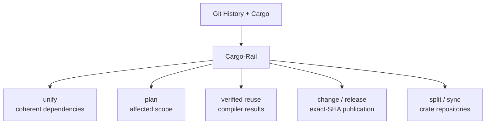

# Cargo-Rail

**Cargo already knows your workspace. Keep it authoritative.**

Cargo-Rail turns Cargo's resolved graph into one monorepo engine. `unify` produces one dependency-coherence report and
mutation plan. `plan` emits typed affected scope for Cargo, nextest, Just, and CI. Verified compiler reuse survives
`cargo clean`. `change` and `release` turn reviewed changesets into version bumps, changelogs, dep-ordered publication,
and resumable exact-SHA releases. `split` and `sync` keep standalone crates tied to monorepo source and history.

**One captured workspace. Explicit authority.**

[](https://crates.io/crates/cargo-rail)
[](https://github.com/loadingalias/cargo-rail/actions/workflows/commit.yaml)
[](https://github.com/loadingalias/cargo-rail/blob/main/Cargo.toml)

## One engine, not ten partial workspace models

Rust monorepos usually acquire a tool for every symptom. Each tool reconstructs part of the same workspace, carries its own configuration, and makes decisions against a slightly different model.

Cargo-Rail consolidates those decisions in one local, Cargo-native engine:

| Fragmented workflow | Use | What changes |
|---|---|---|
| Dependency version, feature, unused-edge, inheritance, and MSRV analysis | `cargo rail unify` | One reviewable and reversible graph-repair plan |
| `dorny/paths-filter`, YAML path globs, and package-selection scripts | `cargo rail plan` | Typed affected scope derived from Git and the resolved Cargo graph |
| Persisted `target/` directories and local cache glue | Verified compiler reuse | Exact reusable results remain available after `cargo clean` and across target directories within one physical source root |
| `release-plz`, `cargo-release`, `git-cliff`, and publish-order scripts | `cargo rail change` and `cargo rail release` | Reviewed release intent carried through exact-SHA publication and recovery |
| Copybara or custom monorepo-to-crate scripts | `cargo rail split` and `cargo rail sync` | Cargo-aware synchronization with source history and recovery evidence |

Cargo-Rail does not coordinate other tools behind the scenes. Its workflows derive decisions from the same captured
Cargo and source authority.



No hosted service. No second build language. No hand-rolled crate maps.

Cargo, nextest, GitHub Actions, Just, and your CI workers remain in place. Cargo-Rail makes them do less work and consume fewer resources.

## Proof First; Then Migrate

Install Cargo-Rail and inspect a real branch:

```bash
cargo install cargo-rail --locked
cargo rail plan --merge-base --explain
```

`plan` is read-only. It does not execute selected work or edit tracked files.

Inspect the typed test scope, then pass its argument vector to nextest:

```bash
PLAN_JSON=$(cargo rail plan --merge-base -f json)
if [ "$(jq -r '.surfaces.test.enabled' <<<"$PLAN_JSON")" = "true" ]; then
  CARGO_ARGS=()
  while IFS= read -r argument; do
    CARGO_ARGS+=("$argument")
  done < <(jq -r '.surfaces.test.scope.cargo_args[]' <<<"$PLAN_JSON")
  cargo nextest run "${CARGO_ARGS[@]}"
fi
```

The plan carries separate build and test scopes. Existing jobs can consume the same versioned contract through [`cargo-rail-action`](https://github.com/loadingalias/cargo-rail-action), JSON, or GitHub output; Cargo-Rail does not reinterpret Cargo or nextest arguments.

## One `unify` command, not a dependency-tool stack

Dependency hygiene is not six unrelated lint problems. It is one graph-coherence problem.

```bash
cargo rail unify --check --explain
```

One pass detects and plans repairs for:

- dependency-version drift;
- hidden feature coupling;
- unused dependency edges;
- workspace-inheritance drift;
- MSRV mismatches; and
- optional host-owned pins for fragmented transitive features.

Graph-removing decisions carry compiler evidence. Cargo-Rail validates the resulting Cargo graph before applying lossless TOML edits.

Apply with a backup:

```bash
cargo rail unify --backup
```

Review the resulting diff, or restore the latest backup:

```bash
cargo rail unify undo
```

**One install. One configuration. One report. One explanation format. One rollback path.**

That gives dependency changes one evidence model, review surface, and recovery path.

## Affected CI is a graph query, not a path glob

A path filter can tell you which directory changed. It cannot reliably tell you what the change affects.

Cargo-Rail interprets the change before selecting work:

```text
changed source
  → semantic manifest and lockfile analysis
  → Cargo package ownership
  → reverse-dependency impact
  → build / test / docs / bench / infra / custom surfaces
  → surface-specific Cargo scope
  → typed Cargo arguments and CI gates
```

A formatting-only manifest edit can select no package work. A shared-library change can select its affected dependent
closure. Infrastructure changes can gate repository-level jobs without pretending they belong to a crate.

When planning evidence is incomplete, Cargo-Rail widens the scope instead of guessing narrowly.

The same versioned plan drives:

- human explanations;
- JSON and GitHub output;
- surface gates; and
- typed Cargo package arguments.

There is only one implementation of “affected.”

## Compiler reuse that survives `cargo clean`

Normal Cargo reuse is tied to the target directory. Remove that directory or run:

```bash
cargo clean
```

and that reuse is gone.

Cargo-Rail's local content-addressed store lives outside `target/`. Eligible compiler results remain available after
`cargo clean` and across target directories within the same physical source root. Cargo-Rail runs rustc with its
original arguments and binds the workspace root plus each unit's physical source namespace into the action. A moved or
independent checkout compiles cold and records its own exact variant instead of restoring path-bearing metadata from
another root.

Install the private user-wide launcher and authenticated cache worker once. Preview is read-only and exits 1 when
setup or repair is pending:

```bash
cargo rail cache setup --check
cargo rail cache setup

cargo check

cargo clean

cargo check
```

The same setup covers ordinary Cargo, nextest, Just, IDE, and CI invocations that use that Cargo home. Cargo freshness
and incremental compilation remain the faster L0; eligible compiler work that L0 does not remove
can use the verified local CAS as L1.

Cargo-Rail does not restore an old target directory or manufacture Cargo freshness. Before a hit, it revalidates:

- Cargo, rustc, rustdoc, sysroot, backend, host, and wrapper identity;
- the complete bounded source-directory topology and regular-file bytes;
- dependency artifacts;
- every compiler-visible environment name and value;
- rustc's selected-input containment proof;
- exact native-static search namespaces and generated inputs;
- on Linux linked actions, the default `cc` driver and its selected dependency-file-capable ELF linker, auxiliary
  tools, direct inputs, found and missing search candidates, exact dependency archives, and rustc-generated objects
  under the linked output directory;
- action and result identity; and
- exact stored output bytes and regular-file modes.

The cache does not partition every compiler unit by the complete Cargo configuration or `Cargo.lock`. Output-neutral
changes such as warning policy, job count, build or target directory, network policy, registry settings, and unrelated
lockfile entries can reuse a verified result. Rust flags, features, dependency contents, target, linker, sysroot,
source topology, and compiler environment still change or reject reuse at their owning boundary.

A matching lookup is not enough. Incomplete or unsupported evidence produces a named bypass and runs normal Cargo.
The pre-Clap compiler boundary rejects ambiguous wrapper roles and skips session/CAS acquisition for disabled,
incremental, clippy, response-file, and other clearly unsupported invocations.

Metadata/rlib results, including metadata-only proc-macro producers, and exact native-static consumers use the direct
action protocol. On Linux, the installed default `cc`-selected ELF linker can also certify build-script executables,
proc-macro producer dylibs, ordinary final binaries, `dylib`, and `cdylib` outputs when it supplies GNU-compatible
dependency-file evidence. The pre-link action is only a candidate selector; a hit requires the complete witnessed
action and exact result pack. Native proc-macro
consumers remain cold because running a proc macro can observe ambient filesystem, environment, process, network,
clock, and randomness state that rustc does not certify.

**Fast when proven. Normal Cargo when not.**

`CARGO_RAIL_CACHE=off cargo check` disables both L1 reads and writes for that process tree. The minimal launcher
directly executes the selected compiler chain without starting the cache worker or reading installation state.
Incremental, clippy, native proc-macro consumer, custom-target-layout, ambiguous-wrapper, custom-linker, and otherwise
unsupported invocations bypass before session or CAS acquisition. Existing workspace wrappers are preserved and
bypassed; conflicting global wrapper ownership makes setup fail.

The same one-time setup can persist an AWS S3, Azure Blob Storage, or Cloudflare R2 team authority beneath L1. Ordinary
Cargo then uses a short-lived private coordinator to reuse credential resolution, the SDK client, and connections
across rustc processes; it retains no build-result memory cache. Local hits make no remote request, and coordinator,
remote, integrity, credential, or outage failures compile cold or use the qualified direct fallback. Repository
configuration cannot select a destination. See [Share compiler reuse across workspaces](docs/cache-sharing.md) for URL,
trust, read-only, and provider-qualification boundaries.

### Performance qualification

The transparent activation contract invalidates earlier pre-linked benchmark numbers. Its canonical five-sample
interleaved corpus measures intact-target overhead, cold-path overhead, and empty-target L1 against pinned
local `sccache` independently. A matrix cell qualifies only when all five samples pass the declared correctness and
coverage gates and warm L1 is strictly faster at both p50 and p95. Cargo-Rail makes no blanket superiority claim from a
failed cell. The exact correctness fixture remains independent of timing and verifies root isolation, environment
invalidation, diagnostic replay, output bytes, Cargo L0 behavior, cold publication, and warm reuse.

See [Caching](docs/caching.md) for the proof model and support matrix, and [Benchmarking](docs/benchmarking.md) for the
complete measurement scope and acceptance rules.

## Release intent belongs in the pull request

Most release automation tries to reconstruct intent after the code has already merged.

Cargo-Rail records it while the change is being reviewed:

```bash
cargo rail change add rail-core \
  --bump minor \
  --message "Added graph-aware release planning."
```

The resulting `.changes/*.md` file lives beside the code change. Reviewers see the intended version bump and user-facing release note before merge—not weeks later when a release bot tries to infer them from commit messages.

CI can require release intent for every changed crate:

```bash
cargo rail change check --merge-base --required
```

A release then carries that reviewed intent through the entire workflow:

```text
code + reviewed .changes/*.md
              │
              ▼
       versions + changelogs
              │
              ▼
       exact release commit
              │
              ▼
        readiness on that SHA
              │
              ▼
     dependency-ordered publication
              │
              ▼
      registry observation + tags
              │
              ▼
       durable recovery state
```

Prepare a release pull request containing version and changelog updates:

```bash
cargo rail release run --all --bump auto --pr
```

After that exact release commit merges:

```bash
cargo rail release finalize --all
```

Cargo-Rail validates the release state, publishes crates in dependency order, observes registry results, and creates tags after publication.

Publication is authorized by the exact release commit—not by a moving branch head.

If publication is interrupted, the transaction is not left ambiguous:

```bash
cargo rail release status
cargo rail release resume <STATE>
```

Changesets are not merely a nicer changelog format. They connect **reviewed intent**, **workspace-aware versioning**, **publication order**, **the exact authorized SHA**, and **recoverable side effects**.

## Split a crate without creating a second history

Publishing a crate from a private monorepo usually creates another synchronization system—and eventually another source of truth.

Cargo-Rail keeps the split repository tied to its monorepo origin.

`split` extracts the relevant Git history and rewrites workspace-relative manifests:

```bash
cargo rail split run my-crate --check
cargo rail split run my-crate
```

`sync` maps later commits in either direction:

```bash
cargo rail sync my-crate --to-remote
cargo rail sync my-crate --from-remote
```

Inbound changes arrive on review branches. Synchronization uses Git's three-way merge, and manual conflicts are recorded in resumable receipts.

This is Cargo-aware crate synchronization, not a general-purpose repository-transformation language.

## The savings compound

Cargo-Rail removes work in the order it appears:

```text
unify
  → removes graph waste, hidden coupling, background resource consumption

plan
  → removes unaffected jobs

package scope
  → removes unaffected crates inside selected jobs

verified reuse
  → removes compiler invocations from the work that remains
```

These optimizations compound because they derive from the same captured source tree and resolved Cargo graph. The context is passed around... it's not re-computed.

Independent tools cannot compound as effectively: each optimization is bounded by its own approximation of the workspace.

## Conservative where correctness matters

Cargo-Rail treats speed as conditional and side effects as transactions:

- **Plan before effect.** Checks, explanations, schemas, and mutation previews expose decisions before effects.
- **Widen instead of undertesting.** Incomplete planning evidence selects more work rather than silently excluding required work.
- **Run cold instead of trusting weak cache evidence.** Unsupported or incomplete reuse cases execute normal Cargo.
- **Revalidate before mutation.** Snapshot-bound commands confirm their assumptions immediately before writing, publishing, or synchronizing.
- **Preserve user-owned configuration.** Manifest and configuration edits are lossless outside fields owned by the operation.
- **Record recovery state.** Backups, plans, receipts, and durable release or sync state remain available where recovery requires them.

Fast paths are used only when their proof boundary holds.

## Adopt the deletion, not the entire product

Each workflow is independently adoptable:

1. **Observe** with `cargo rail plan --merge-base --explain`.
2. **Inspect** each selected surface's typed `cargo_args`.
3. **Pass** that argument vector to Cargo or nextest in existing jobs.
4. **Enforce** read-only dependency and changeset checks.
5. **Apply** graph repairs, release effects, or repository synchronization after the team trusts their plans and recovery boundaries.

Adopt a workflow when it deletes a second source of truth. Do not adopt it merely because Cargo-Rail implements it.

## Installation

```bash
cargo install cargo-rail --locked
```

Or install a pre-built binary:

```bash
cargo binstall cargo-rail
```

Pre-built archives, SHA-256 checksums, and signed provenance are published with
[GitHub Releases](https://github.com/loadingalias/cargo-rail/releases).

Release archives place Cargo-Rail's private compiler shim beside the CLI. Keep both files together when moving a
manual installation; Cargo-Rail remains correct without the shim but falls back to the larger CLI executable for
compiler-wrapper processes.

The current MSRV is published in
[`Cargo.toml`](https://github.com/loadingalias/cargo-rail/blob/main/Cargo.toml).

## Documentation

- [Planning](docs/planning.md)
- [Configuration reference](docs/config.md)
- [Command reference](docs/commands.md)
- [Architecture](docs/architecture.md)
- [Caching](docs/caching.md)
- [Share local compiler reuse across workspaces](docs/cache-sharing.md)
- [Benchmarking](docs/benchmarking.md)
- [Troubleshooting and recovery](docs/troubleshooting.md)
- [Migrate from cargo-hakari](docs/migrate-hakari.md)
- [Migrate from git-cliff or release-plz](docs/migrate-git-cliff.md)
- [Examples](examples/)

## Project

Cargo-Rail is licensed under [MIT](LICENSE).

- [Contributing](CONTRIBUTING.md)
- [Security policy](SECURITY.md)
- [Issue tracker](https://github.com/loadingalias/cargo-rail/issues)
