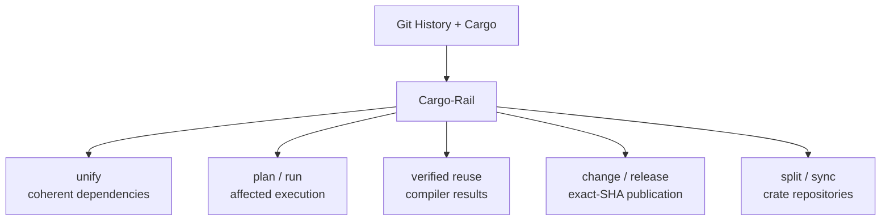

# Cargo-Rail

**Cargo already knows your workspace. Stop teaching it to ten other tools.**

Cargo-Rail turns Cargo's resolved graph into one monorepo engine. `unify` replaces the dep-hygiene stack. `plan` and `run` execute only affected work. Verified compiler reuse survives `cargo clean`. `change` and `release` turn reviewed changesets into version bumps, changelogs, dep-ordered publication, and resumable exact-SHA releases. `split` and `sync` keep standalone crates tied to monorepo source and history.

**Keep Cargo. Delete the Rest.**

[](https://crates.io/crates/cargo-rail)
[](https://github.com/loadingalias/cargo-rail/actions/workflows/commit.yaml)
[](https://github.com/loadingalias/cargo-rail/blob/main/Cargo.toml)

## One engine, not ten partial workspace models

Rust monorepos usually acquire a tool for every symptom. Each tool reconstructs part of the same workspace, carries its own configuration, and makes decisions against a slightly different model.

Cargo-Rail replaces that collection with one local, Cargo-native engine:

| Retire | Use | What changes |
|---|---|---|
| `cargo-hakari`, `cargo-udeps`, `cargo-shear`, `cargo-machete`, feature auditors, workspace-inheritance checks, and MSRV scripts | `cargo rail unify` | One reviewable and reversible graph-repair plan |
| `dorny/paths-filter`, YAML path globs, and package-selection scripts | `cargo rail plan` and `cargo rail run` | Affected work derived from Git and the resolved Cargo graph |
| Persisted `target/` directories and local cache glue | Verified compiler reuse | Exact reusable results remain available after `cargo clean` and across target directories within one physical source root |
| `release-plz`, `cargo-release`, `git-cliff`, and publish-order scripts | `cargo rail change` and `cargo rail release` | Reviewed release intent carried through exact-SHA publication and recovery |
| Copybara or custom monorepo-to-crate scripts | `cargo rail split` and `cargo rail sync` | Cargo-aware synchronization with source history and recovery evidence |

Cargo-Rail does not coordinate those tools behind the scenes. It replaces the duplicated workspace models they require and shares the same contextual authority.



No hosted service. No second build language. No hand-rolled crate maps.

Cargo, nextest, GitHub Actions, your task runner, and your runners remain in place. Cargo-Rail just makes them do less work and consume fewer resources.

## Proof First; Then Migrate

Install Cargo-Rail and inspect a real branch:

```bash
cargo install cargo-rail --locked
cargo rail plan --merge-base --explain
```

`plan` is read-only. It does not execute selected work or edit tracked files.

Preview the exact commands Cargo-Rail would run:

```bash
cargo rail run --merge-base --dry-run --print-cmd --explain
```

Then keep the rest of your toolchain and execute only affected CI work:

```bash
cargo rail run --merge-base --profile ci
```

The built-in `ci` profile runs selected build and test actions. Existing jobs can consume the same versioned plan through [`cargo-rail-action`](https://github.com/loadingalias/cargo-rail-action), JSON, or GitHub output.

## One `unify` command, not a dependency-tool stack

Dependency hygiene is not six unrelated lint problems. It is one graph-coherence problem.

```bash
cargo rail unify --check --explain
```

One pass detects and plans repairs for:

- dependency-version drift;
- hidden feature coupling;
- unused dependency edges;
- workspace-inheritance drift;
- MSRV mismatches; and
- transitive feature unification normally handled through a generated workspace-hack crate.

Graph-removing decisions carry compiler evidence. Cargo-Rail validates the resulting Cargo graph before applying lossless TOML edits.

Apply with a backup:

```bash
cargo rail unify --backup
```

Review the resulting diff, or restore the latest backup:

```bash
cargo rail unify undo
```

**One install. One configuration. One report. One explanation format. One rollback path.**

That is the real replacement for a directory full of Cargo plugins and maintenance scripts.

## Affected CI is a graph query, not a path glob

A path filter can tell you which directory changed. It cannot reliably tell you what the change affects.

Cargo-Rail interprets the change before selecting work:

```text
changed source
  → semantic manifest and lockfile analysis
  → Cargo package ownership
  → reverse-dependency impact
  → build / test / docs / bench / infra / custom surfaces
  → surface-specific Cargo scope
  → validated commands and CI outputs
```

A formatting-only manifest edit can select no package work. A shared-library change can select its affected dependent closure. Infrastructure changes can select repository-level actions without pretending they belong to a crate.

When planning evidence is incomplete, Cargo-Rail widens the scope instead of guessing narrowly.

The same versioned plan drives:

- human explanations;
- JSON and GitHub output;
- dry-run command previews;
- direct execution; and
- durable decision receipts.

There is only one implementation of “affected.”

## Compiler reuse that survives `cargo clean`

Normal Cargo reuse is tied to the target directory. Remove that directory or run:

```bash
cargo clean
```

and that reuse is gone.

Cargo-Rail's local content-addressed store lives outside `target/`. Eligible compiler results remain available after
`cargo clean` and across target directories within the same physical source root. Cargo-Rail runs rustc with its
original arguments and binds the workspace root plus each unit's physical source namespace into the action. A moved or
independent checkout compiles cold and records its own exact variant instead of restoring path-bearing metadata from
another root.

On an eligible invocation, this sequence can still reuse exact compiler output:

```bash
cargo rail run --all --action build --explain

cargo clean

cargo rail run --all --action build --explain
```

Cargo-Rail does not restore an old target directory or manufacture Cargo freshness. Before a hit, it revalidates:

- Cargo, rustc, rustdoc, sysroot, backend, host, and wrapper identity;
- the complete bounded source-directory topology and regular-file bytes;
- dependency artifacts;
- every compiler-visible environment name and value;
- rustc's selected-input containment proof;
- action and result identity; and
- exact stored output bytes and regular-file modes.

The cache does not partition every compiler unit by the complete Cargo configuration or `Cargo.lock`. Output-neutral
changes such as warning policy, job count, build or target directory, network policy, registry settings, and unrelated
lockfile entries can reuse a verified result. Rust flags, features, dependency contents, target, linker, sysroot,
source topology, and compiler environment still change or reject reuse at their owning boundary.

A matching lookup is not enough. Incomplete or unsupported evidence produces a named bypass and runs normal Cargo.
The pre-Clap compiler boundary rejects ambiguous wrapper roles and skips session/CAS acquisition for disabled,
incremental, clippy, response-file, and other clearly unsupported invocations.

**Fast when proven. Normal Cargo when not.**

Set `[cache] l2 = "alias"` to share verified results through a machine-owned S3 target when the canonical physical
source root is identical. The command parent owns AWS access; compiler wrappers receive only a loopback capability. A
local hit remains network-free, and remote bytes enter the ordinary local proof before restore. A moved or independent
checkout compiles cold. Remote unavailability, credentials, authentication, or configuration also falls back to cold
compilation. Remote conflict or malformed evidence fails without restoring output.

Use one canonical checkout path and toolchain on compatible CI runners and SSH build hosts to exchange results through
L2. Each machine keeps a private L1; CI and SSH principals can have separate read or read-write authority over the same
immutable S3 namespace. See [Share native compiler results across CI and SSH](docs/cache-sharing.md) for the complete
local, CI, SSH, and CI-to-SSH workflow.

### Measured clean-target impact

The retained v10 benchmark ran ten accepted interleaved groups on an Apple M1 Pro with macOS, APFS, and Rust 1.95.0.
Each native Cargo baseline and Cargo-Rail warm-L1 lane started with an empty target directory. The fixture includes
registry and Git dependencies, build scripts, a proc macro, native code, workspace libraries, and a binary.

| Workload | Native Cargo p50 wall | Cargo-Rail warm-L1 p50 wall | Paired median wall reduction |
|---|---:|---:|---:|
| `cargo check` | 6.65 s | 4.91 s | **25.7%** |
| `cargo build --release` | 9.88 s | 7.40 s | **27.3%** |

Median process-tree CPU fell from 31.70 to 13.44 CPU-seconds for `check` (**57.6% less**) and from 34.59 to 17.91
CPU-seconds for the release build (**48.2% less**). Every warm command accepted 26 verified hits and deliberately
bypassed 31 ungraduated invocations. All 220 measured lane samples preserved exact outputs, diagnostics, action
censuses, and runtime behavior; the validator found zero rejected samples and zero false hits.

This measures the cold-target problem: cleanup, ephemeral CI runners, and fresh remote build hosts. With an intact warm
target directory, Cargo's own fingerprints are already faster and Cargo-Rail delegates that path. These figures measure
local L1 reuse, not first-import S3 latency, and they describe this fixture and host rather than predicting another
workspace. Affected planning compounds the gain by removing unrelated actions before cache lookup begins.

See [Caching](docs/caching.md) for the proof model and support matrix, and [Benchmarking](docs/benchmarking.md) for the
complete measurement scope and confidence bounds.

## Release intent belongs in the pull request

Most release automation tries to reconstruct intent after the code has already merged.

Cargo-Rail records it while the change is being reviewed:

```bash
cargo rail change add rail-core \
  --bump minor \
  --message "Added graph-aware release planning."
```

The resulting `.changes/*.md` file lives beside the code change. Reviewers see the intended version bump and user-facing release note before merge—not weeks later when a release bot tries to infer them from commit messages.

CI can require release intent for every changed crate:

```bash
cargo rail change check --merge-base --required
```

A release then carries that reviewed intent through the entire workflow:

```text
code + reviewed .changes/*.md
              │
              ▼
       versions + changelogs
              │
              ▼
       exact release commit
              │
              ▼
        readiness on that SHA
              │
              ▼
     dependency-ordered publication
              │
              ▼
      registry observation + tags
              │
              ▼
       durable recovery state
```

Prepare a release pull request containing version and changelog updates:

```bash
cargo rail release run --all --bump auto --pr
```

After that exact release commit merges:

```bash
cargo rail release finalize --all
```

Cargo-Rail validates the release state, publishes crates in dependency order, observes registry results, and creates tags after publication.

Publication is authorized by the exact release commit—not by a moving branch head.

If publication is interrupted, the transaction is not left ambiguous:

```bash
cargo rail release status
cargo rail release resume <STATE>
```

Changesets are not merely a nicer changelog format. They connect **reviewed intent**, **workspace-aware versioning**, **publication order**, **the exact authorized SHA**, and **recoverable side effects**.

## Split a crate without creating a second history

Publishing a crate from a private monorepo usually creates another synchronization system—and eventually another source of truth.

Cargo-Rail keeps the split repository tied to its monorepo origin.

`split` extracts the relevant Git history and rewrites workspace-relative manifests:

```bash
cargo rail split run my-crate --check
cargo rail split run my-crate
```

`sync` maps later commits in either direction:

```bash
cargo rail sync my-crate --to-remote
cargo rail sync my-crate --from-remote
```

Inbound changes arrive on review branches. Synchronization uses Git's three-way merge, and manual conflicts are recorded in resumable receipts.

This is Cargo-aware crate synchronization, not a general-purpose repository-transformation language.

## The savings compound

Cargo-Rail removes work in the order it appears:

```text
unify
  → removes graph waste, hidden coupling, background resource consumption

plan
  → removes unaffected actions

package scope
  → removes unaffected crates inside selected actions

verified reuse
  → removes compiler invocations from the work that remains
```

These optimizations compound because they derive from the same captured source tree and resolved Cargo graph. The context is passed around... it's not re-computed.

Independent tools cannot compound as effectively: each optimization is bounded by its own approximation of the workspace.

## Conservative where correctness matters

Cargo-Rail treats speed as conditional and side effects as transactions:

- **Plan before effect.** Checks, explanations, schemas, and dry runs expose decisions before execution or mutation.
- **Widen instead of undertesting.** Incomplete planning evidence selects more work rather than silently excluding required work.
- **Run cold instead of trusting weak cache evidence.** Unsupported or incomplete reuse cases execute normal Cargo.
- **Revalidate before mutation.** Snapshot-bound commands confirm their assumptions immediately before writing, publishing, or synchronizing.
- **Preserve user-owned configuration.** Manifest and configuration edits are lossless outside fields owned by the operation.
- **Record recovery state.** Backups, plans, receipts, and durable release or sync state remain available where recovery requires them.
- **Keep execution explicit.** Repository actions are validated direct-process argument vectors, not an embedded shell language.

Fast paths are used only when their proof boundary holds.

## Adopt the deletion, not the entire product

Each workflow is independently adoptable:

1. **Observe** with `cargo rail plan --merge-base --explain`.
2. **Compare** with `cargo rail run --dry-run --print-cmd`.
3. **Delegate** affected scope to existing jobs.
4. **Enforce** read-only dependency and changeset checks.
5. **Apply** graph repairs, release effects, or repository synchronization after the team trusts their plans and recovery boundaries.

Adopt a workflow when it deletes a second source of truth. Do not adopt it merely because Cargo-Rail implements it.

## Installation

```bash
cargo install cargo-rail --locked
```

Or install a pre-built binary:

```bash
cargo binstall cargo-rail
```

Pre-built archives, SHA-256 checksums, and signed provenance are published with
[GitHub Releases](https://github.com/loadingalias/cargo-rail/releases).

Release archives place Cargo-Rail's private compiler shim beside the CLI. Keep both files together when moving a
manual installation; Cargo-Rail remains correct without the shim but falls back to the larger CLI executable for
compiler-wrapper processes.

The current MSRV is published in
[`Cargo.toml`](https://github.com/loadingalias/cargo-rail/blob/main/Cargo.toml).

## Documentation

- [Planning and execution](docs/planning.md)
- [Configuration reference](docs/config.md)
- [Command reference](docs/commands.md)
- [Architecture](docs/architecture.md)
- [Caching](docs/caching.md)
- [Share native compiler results across CI and SSH](docs/cache-sharing.md)
- [Benchmarking](docs/benchmarking.md)
- [Troubleshooting and recovery](docs/troubleshooting.md)
- [Migrate from cargo-hakari](docs/migrate-hakari.md)
- [Migrate from git-cliff or release-plz](docs/migrate-git-cliff.md)
- [Examples](examples/)

## Project

Cargo-Rail is licensed under [MIT](LICENSE).

- [Contributing](CONTRIBUTING.md)
- [Security policy](SECURITY.md)
- [Issue tracker](https://github.com/loadingalias/cargo-rail/issues)
